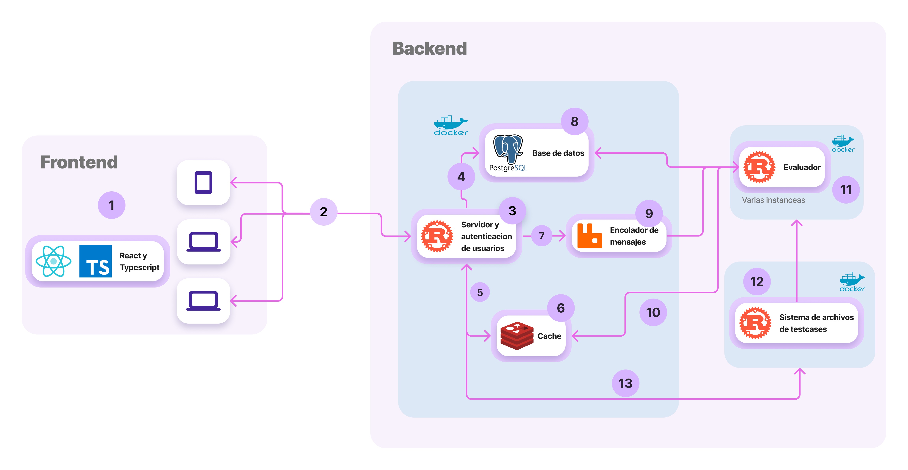

# Arquitectura

El juez en linea usa una arquitectura de microservicios. La siguiente imagen ilustra el diseno de esta. Para cada servicio se da una breve descripcion.

Cada punto es descrito a continuacion:

1. **Frontend**: Implementado como una página web dinámica en Next.js y React, utilizando TypeScript. Se sirve desde el servidor, combinando una estrategia de SPA y servir la página estáticamente como HTML. Esto permite al usuario ver la página sin tener que esperar a que se descargue todo el bundle de JavaScript desde el servidor para el primer renderizado.

2. **Comunicacion entre backend y frontend**: Utiliza dos estándares de comunicación: la arquitectura REST para exponer endpoints consumidos por el frontend, y los SSE (Server Sent Events) para que el frontend escuche eventos disparados por el backend, ideal para el sistema de notificaciones.

3. **Servidor web**: Se encarga de las siguientes tareas:

   - Autenticacion, manejo y registro de usuarios.
   - Limitar las peticiones por usuario.
   - Recibir todos los submits de los usuarios y registrarlas en el encolador.
   - Comunicarse con la base de datos y registrar todas las acciones anteriores.
   - Procesar los concursos.

   El servicio esta implementado en **Rust** usando el framework **Axum**.

4. **Comunicación Servidor Web - Base de Datos**: Utiliza sqlx como manejador para PostgreSQL.
5. **Comunicación Servidor Web - Redis**: Se utiliza para escuchar las notificaciones y registrar las sesiones de usuarios.
6. **Redis**: Sistema de caché que mantiene las sesiones de los usuarios y ofrece funcionalidad pub/sub, utilizada en la implementación de notificaciones en tiempo real.
7. **Cola de envios**: El servidor web encola las peticiones de envios en **Rabbit MQ** para que posteriormente sean evaluadas.
8. **PostgreSQL**: Base de datos elegida por su capacidad para manejar tipos de datos NoSQL y SQL al mismo tiempo, versatilidad de funciones y robustez.
9. **RabbitMQ**: Broker de mensajes utilizado para almacenar y consumir mensajes, permitiendo la comunicación entre los envíos de los usuarios y los evaluadores.
10. Las diferentes instancias de evaluadores estan conectadas con Redis para notificar (por medio de _pub/sub_) el estado de un envio.
11. **Evaluadores**: Ejecutan y califican los envios de los usuarios.Pueden existir múltiples instancias para distribuir la carga de envíos
    Consumen mensajes de **RabbitMQ** y estan conectados con _Redis_ y _PostgreSQL_.
    Implementados en **Rust** y usan **NsJail** para poder hacer _sandboxing_ de la evaluacion.
12. **Sistema de Archivos de casos de prueba**: Almacena y distribuye los testcases a las diferentes instancias de evaluadores disponibles, utilizando bincode para codificar los testcases y enviarlos a los evaluadores.
13. **Conexión Servidor Web - Sistema de Archivos de casos de prueba**: Se utiliza para editar o agregar casos de prueba.

En las secciones posteriores se habla a profundidad sobre cada servicio y tecnologia.
