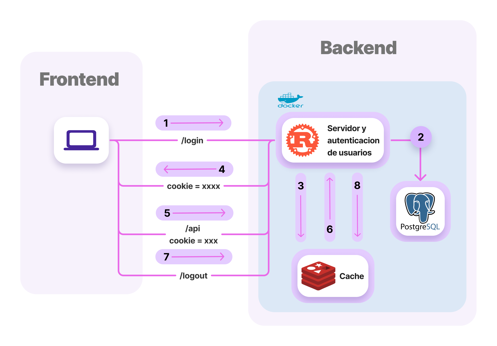

# Autenticacion de usuarios

La autenticación de usuarios es una de las partes más importantes en la administración del juez. Es imperativo tener la capacidad de limitar el acceso que tiene un usuario a los distintos endpoints del juez.

La arquitectura de autenticación se puede observar en el siguiente diagrama:



A continuacion se detalla  la implentacion de cada parte de la autenticación.

1. El usuario hace una peticion inicial a `/login`, este endpoint inicialemte esta definido en `web_server/src/startup.rs`.
    ```rust
    let app = Router::new()
        // declaracion de otros servicios
        .nest(
            "/",
            Router::new()
                .route("/login", post(login_post).get(login_get))
        );
    ```
    Basado en el metodo HTTP con el que se hizo la request ( `GET` o `POST`) el framework elige entre llamar a la funcion `login_post` o llamar a `login_get`, estas funciones estan definidas en `web_server/src/routes/login.rs`.

    - Si la peticion es el metodo `GET` entonces se llama a `login_get`.Esta funcion se encarga de regresar `login.html` que es el HTML necesario para hacer login. Si el usuario ya esta logeado entonces se redirige a `/problems`.

        En este caso `UserSession` que se encuentra como argumento indica la sesion actual.
        ```rust
        pub async fn login_get(session: UserSession) -> Response {
            let file_path = "./static/login.html";
            let login_html = fs::read_to_string(file_path)
                .await
                .expect("Should have been able to read the file");

            match session.get_user_id().await {
                Ok(Some(_)) => Redirect::to("/problems").into_response(),
                _ => Html(login_html).into_response(),
            }
        }
        ```
    - Si la peticion es el metodo `POST` entonces se llama `login_post`. Esta funcion realiza las siguientes acciones:
        - Verificar que la peticion esta codificada en **base 64** y que contiene el header http `application/x-www-form-urlencoded`. Axum automaticamente hace estas validaciones si indicamos que la peticion es una `Form`:
            ```rust
            pub async fn login_post(
                mut session: UserSession, // sesion 
                State(state): State<AppState>, // El estado global del servidor
                Form(form): Form<FormData>, // indicamos que nuestra peticion es una Form
            ) -> Result<Response, SignUpError> {
                /* ... */
            }
            ```
        - Si la peticion es correcta Axum automaticamente la deserializa en la `struct` `FormData`:
            ```rust
            pub struct FormData {
                identifier: String,
                password: Secret<String>,
            }
            ```
2. Con la estructura `FormData` podemos conectarnos a la base de a
        
